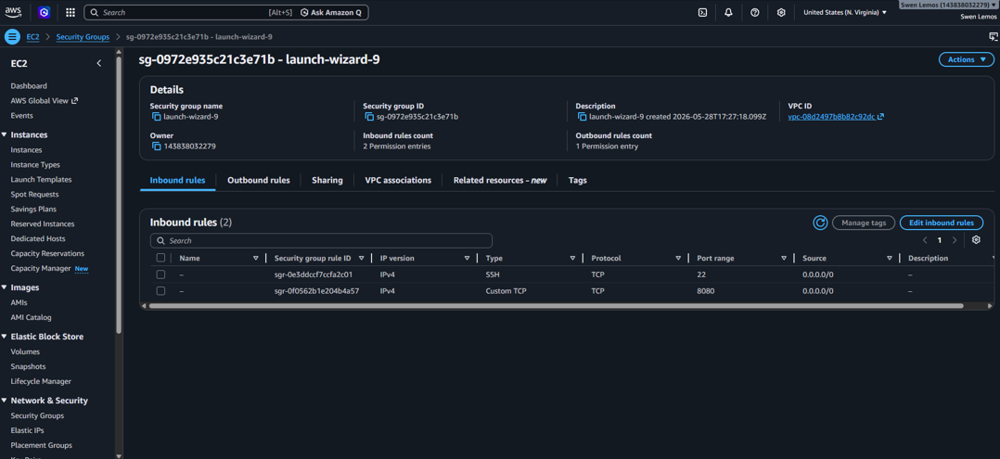
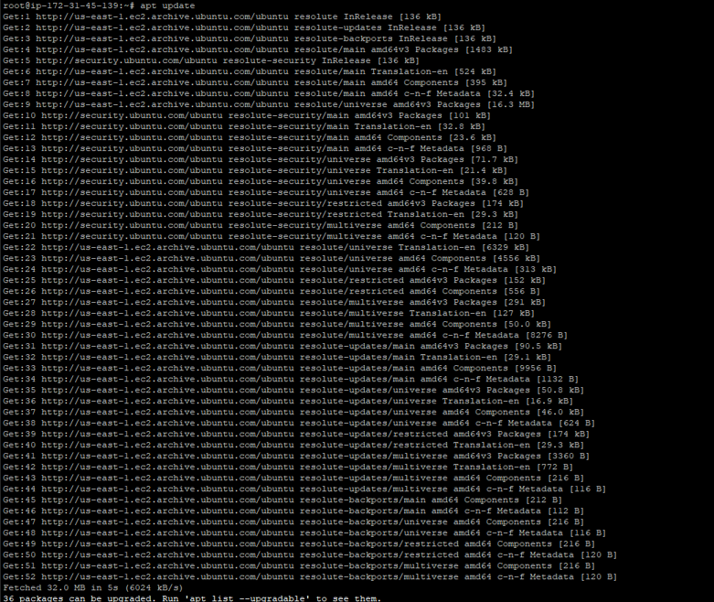
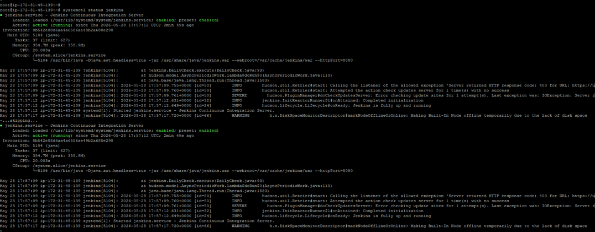
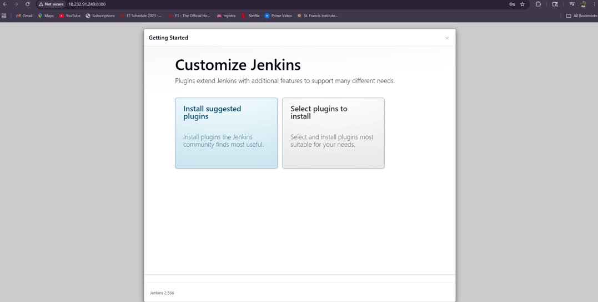

# Jenkins Deployment on AWS EC2

## About the Project

In this project, I deployed Jenkins on an Ubuntu EC2 instance in AWS and configured it for remote access through a web browser. The setup was done using Linux commands and SSH access.

## Tools Used

- AWS EC2
- Ubuntu Linux
- Jenkins
- Java
- SSH
- AWS Security Groups

## Steps Followed

### 1. Created an EC2 Instance

- Launched an Ubuntu EC2 instance
- Downloaded the PEM key
- Connected to the server using SSH

### 2. Configured Security Group

Added the following inbound rules:

| Port | Usage |
|------|--------|
| 22 | SSH Access |
| 8080 | Jenkins Access |

### 3. Updated the Server

sudo apt update

### 4. Installed Java

sudo apt install openjdk-21-jdk -y

### 5. Installed Jenkins

sudo apt install jenkins -y

### 6. Started Jenkins

sudo systemctl enable jenkins
sudo systemctl start jenkins
sudo systemctl status jenkins

### 7. Accessed Jenkins

Jenkins was accessed through the EC2 public IP on port 8080.

## Screenshots

### EC2 Instance

![EC2 Instance]01-ec2-instance.png)

### Security Group

### Package Update

### Jenkins Status

### Jenkins Dashboard

## Outcome

Successfully deployed Jenkins on an AWS EC2 instance and accessed the Jenkins dashboard remotely through port 8080.
